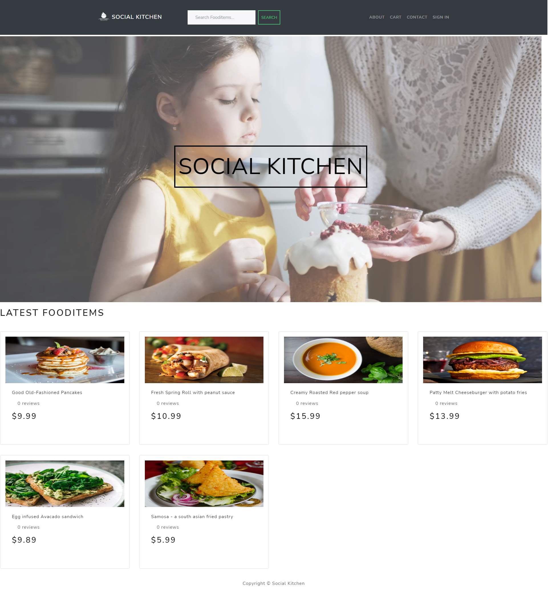
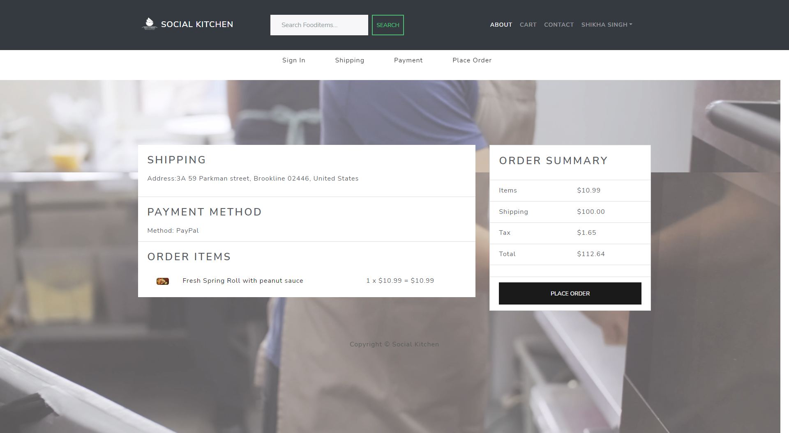

# INFO 6150 Web Design & User Experience Final Project

## Authors:
  - Sai Sumanth Kammal Shetty (NUID: 002770015)
  - Shikha Singh (NUID: 002770739)
  - Janani Gopalakrishnan (NUID: 002663579)
  - Kaushik Elangovan (NUID: 002793494)
  - Deepa Guruvayurappan (NUID: 002128025)
  - Ravindra Kalyanji Chahbhadia (NUID: 002796610)

# Topic: Social Kitchen

Social Kitchen is a dream towards living with a balanced diet
We serve the best homemade food available at your doorstep.
Passionate about delivering wholesome, fresh and nutritions food right at your doorsteps.
Our Mission is to help people learn more about food, eating habits, and ways to stay healthy (not just physically but also spiritually) and ultimately get Joy out of this beautiful blessing called LIFE. Natural ingredients We use the absolute best ingredients money can buy and EVERYTHING we do is about flavor, quality, and taste that consumers love. We understand your need to stay fit and eat healthily and hence we are here with dishes that will not only help you stay fit but are tasty as well.

Live your best life with Social Kitchen!



## Project Features and Requirements integrated:

1. Mobile UI friendly/Responsive
2. Multiple roles - Admin, and Customers(s)
3. Login & Registration pages - With password encryption(bcrypt)

4. Multiple pages have been created - About, Order, Cart, Contact etc.
5. Following are the major transactions encoported in the project:
  - Admin can view all account and roles
  - Food Owner can add the items to the menu
  
  - Customer can view the items
  - Customer can add and delete food items from the cart
  - Customer can place the order and proceed to payment
  - Additionally all roles can update their profile details
6. Session management is maintained in the project
7. Data is consistant throughtout the project
8. End-to-end transaction is fulfilled for the customer from the point they view the menu to successfully placing and reciving the order

9. Frontend User interface usage of HTML, CSS, and Bootstrap is mandatory apart from any additional third-party library is fine
10. Payment gateway API is used at the customers end to place and confirm order
11. Website has been hosted using github pages
12. CRUD operations have been included for all the roles
13. REST API architecture has been maintained
14. All team member contributions have been maintained in the git repository
15. git ignore and README file has been included

## Technologies Used:

1. Frontend: React Framework
2. Backend: Node.js & Express
3. Database: MongoDB

## Deployment:

GitHub Pages

```
Website URL : 
```

## Setup:

- Clone the repository using git clone command
- Open the project on vscode
- Run the below commands:
```
npm install
cd frontend && npm install
cd ..
npm run dev
```
